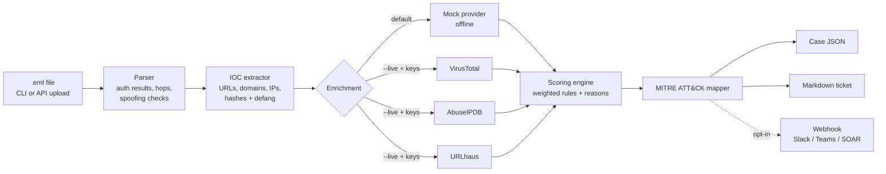

# phishir: SOAR-lite Phishing Incident Response Pipeline


`phishir` takes a reported email (`.eml`), triages it the way a SOC analyst would, and produces a case file, a ready-to-paste incident ticket, and an optional chat/SOAR notification. It does this in under a second, with no API keys needed to try it.

It's the first 15 minutes of a phishing investigation, automated: header forensics, IOC extraction, threat-intel enrichment, a severity score you can explain line by line, and MITRE ATT&CK mapping.

## What it does

| Stage | What happens |
|---|---|
| **Parse** | Reads SPF / DKIM / DMARC from `Authentication-Results`, rebuilds the `Received` hop path, flags Reply-To and Return-Path mismatches and display-name spoofing (brand claims and embedded fake addresses). |
| **Extract** | Pulls URLs (text and `href`), domains, IPs, sender addresses and attachment SHA-256/MD5 hashes. Everything is deduplicated and **defanged** (`hxxps[://]bad[.]test`). |
| **Enrich** | Runs IOCs through pluggable providers: **VirusTotal**, **AbuseIPDB**, **URLhaus**. An offline **mock provider** is the default, so the demo and tests never touch the network. |
| **Score** | A 0-100 score built from weighted rules. Every point comes with a reason (`+20 dmarc_fail - DMARC policy evaluation failed`). |
| **Map** | Tags MITRE ATT&CK techniques: T1566.001/.002, T1598.003, T1204.x, T1656. |
| **Report** | Writes `CASE.json` and a `CASE.md` ticket, and can optionally post to a webhook (off by default). |

## Architecture



## Quick start

```bash
git clone https://github.com/Dinesh-Melimi/phishing-ir-automation.git
cd phishing-ir-automation
pip install -r requirements-dev.txt
make demo          # analyze all 5 sample emails into cases/
make check         # ruff + bandit + pytest
```

```text
$ python -m phishir analyze samples/*.eml -o cases/
PHISH-20261006-B3E62822  LOW        0/100  samples/01_benign_newsletter.eml
PHISH-20261006-AF202644  CRITICAL 100/100  samples/02_phish_credential_harvest.eml
PHISH-20261006-C2002F25  CRITICAL 100/100  samples/03_phish_html_attachment.eml
PHISH-20261006-5A985EBD  HIGH      45/100  samples/04_phish_payroll_bec.eml
PHISH-20261006-76C851B8  LOW        0/100  samples/05_benign_it_notice.eml
```

See a full output in [`examples/sample_ticket_credential_harvest.md`](examples/sample_ticket_credential_harvest.md) and [`examples/sample_case_credential_harvest.json`](examples/sample_case_credential_harvest.json).

### CLI options

| Flag | Purpose |
|---|---|
| `-o DIR` | Output directory (default `cases/`) |
| `--live` | Use real intel providers for whichever API keys are set |
| `--webhook` | Post a summary to `PHISHIR_WEBHOOK_URL` (also requires `PHISHIR_WEBHOOK_ENABLED=1`) |
| `--fail-on SEV` | Exit code 2 if any email reaches `SEV`, so it can gate a mailbox-polling job |

### API

```bash
export PHISHIR_API_KEY=$(python -c "import secrets;print(secrets.token_urlsafe(32))")
make api
curl -s -H "X-API-Key: $PHISHIR_API_KEY" -F file=@samples/03_phish_html_attachment.eml \
     http://127.0.0.1:8000/analyze | jq '.case.severity, .case.score'
```

- `GET /health`: liveness check, no auth
- `POST /analyze`: multipart `.eml` upload, max 10 MB. Returns the case JSON plus the Markdown ticket. The key is checked with a constant-time compare. If no key is configured, the server returns `503` instead of running open.

### Docker

```bash
docker build -t phishir .
docker run --rm -e PHISHIR_API_KEY=change-me -p 8000:8000 phishir
```

The image is based on `python:3.12-slim`, runs as non-root UID 10001, and includes a healthcheck.

## Configuration

All settings come from environment variables. See [`.env.example`](.env.example).

| Variable | Default | Meaning |
|---|---|---|
| `PHISHIR_LIVE` | `0` | `1` enables real providers (same as `--live`) |
| `VT_API_KEY` / `ABUSEIPDB_API_KEY` / `URLHAUS_API_KEY` | unset | A provider only activates when its key is present |
| `PHISHIR_API_KEY` | unset | Required for `/analyze` |
| `PHISHIR_WEBHOOK_ENABLED` / `PHISHIR_WEBHOOK_URL` | `0` / unset | Both are required, and the URL must be HTTPS |

## Scoring model

The weights live in one table (`phishir/scoring.py::WEIGHTS`) so they're easy to review and tune.

| Rule | Points | | Rule | Points |
|---|---|---|---|---|
| `dmarc_fail` | 20 | | `credential_lure` | 15 |
| `display_name_spoof` | 20 | | `financial_request` (BEC) | 15 |
| `risky_attachment` | 20 | | `urgency_language` | 10 |
| `spf_fail` / `dkim_fail` | 15 each | | `link_text_mismatch` | 10 |
| `reply_to_mismatch` | 15 | | `url_ip_host` | 10 |
| `intel_malicious` | 30 | | `intel_suspicious` | 10 |

The score is capped at 100. Bands: **critical** is 70 or more, **high** 45 or more, **medium** 20 or more, and anything lower is **low**. Each band maps to the recommended actions in the ticket and to the response steps in [`docs/PLAYBOOK.md`](docs/PLAYBOOK.md).

## Samples

All five sample emails are **fictional**. They use only `example.com` / `example.net` / `.test` domains and RFC 5737 documentation IPs. None of them contains a real malicious URL or payload.

| File | Scenario | Expected |
|---|---|---|
| `01_benign_newsletter.eml` | Authenticated marketing mail | low |
| `02_phish_credential_harvest.eml` | Fake "Microsoft 365" mailbox-suspension lure with a mismatched link | critical |
| `03_phish_html_attachment.eml` | Overdue invoice with an HTML-smuggling-style attachment | critical |
| `04_phish_payroll_bec.eml` | CEO impersonation asking to change direct deposit (no links, passes auth) | high |
| `05_benign_it_notice.eml` | Internal maintenance notice | low |

Sample 04 is there on purpose. **BEC passes SPF/DKIM/DMARC** because the attacker owns the domain, so the detection has to rely on content and identity signals.

## Project layout

```
phishir/        parser, iocs, enrichment, scoring, mitre, report, webhook, pipeline, cli, api
tests/          37 pytest tests (offline; HTTP providers tested via httpx.MockTransport)
samples/        5 fictional .eml files
examples/       generated case JSON + ticket
docs/           PLAYBOOK.md (NIST SP 800-61), INTERVIEW_WALKTHROUGH.md
```

## Limitations and roadmap

- The organizational domain is approximated with the last two labels. Production code should use the Public Suffix List (`tldextract`).
- The parser trusts the receiving MTA's `Authentication-Results` and does not re-verify DKIM itself (a possible addition is `dkimpy`).
- Planned: mailbox ingestion (Graph API / IMAP), URL detonation sandbox, STIX 2.1 export, a TheHive/Jira ticket connector, and caching and rate-limiting for intel lookups.

## License

MIT © 2026 Dinesh Melimi
